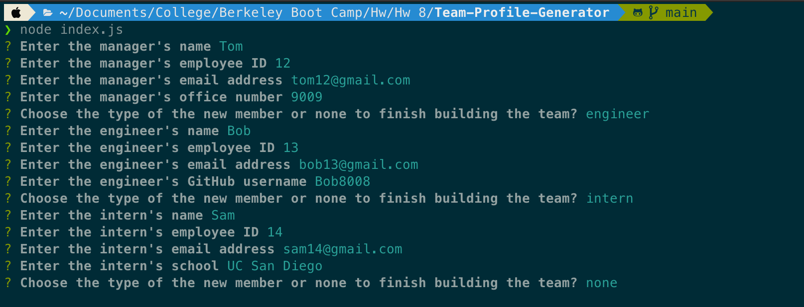

# Team Profile Generator

## Description

It's a application that helps the user build a profile for a team. It utilizes several prompts for user input on data such as employee type and the relevant information for that type of employee. It then generates HTML code using the input information from the user to generate a website that contains the team's profile.

## Installation

To run the application:

- Run the command `npm init -y` to set up a new npm package
- Run the command `npm i` to install the prerequisites
- Run the command `npm i inquirer` to install the inquirer package
- Run the command `node index.js` to run the application

## Usage

After starting the application, answer the command line prompts to enter the required information. When finished, choose 'none' to see the generated website.

## Credits

hugh18019  
GitHub Profile: https://github.com/hugh18019

## Tests

Run the command `npm start test` to run the tests.

## License

Licensed under the [MIT License](LICENSE).
